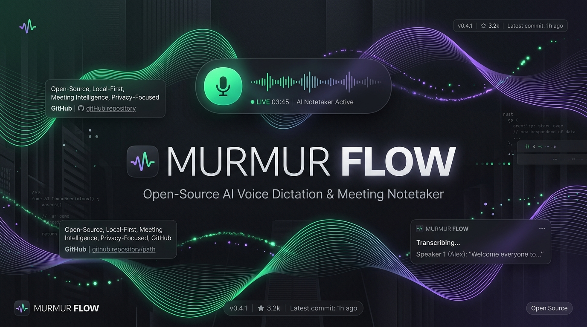
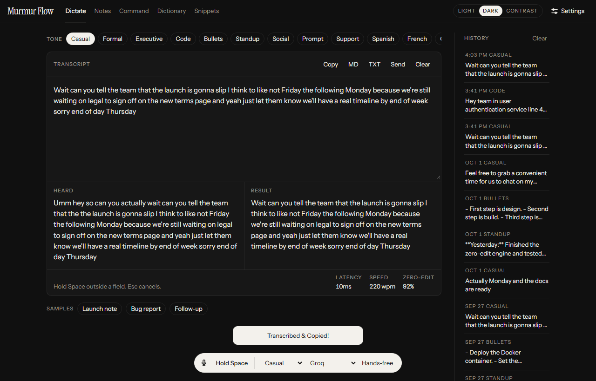
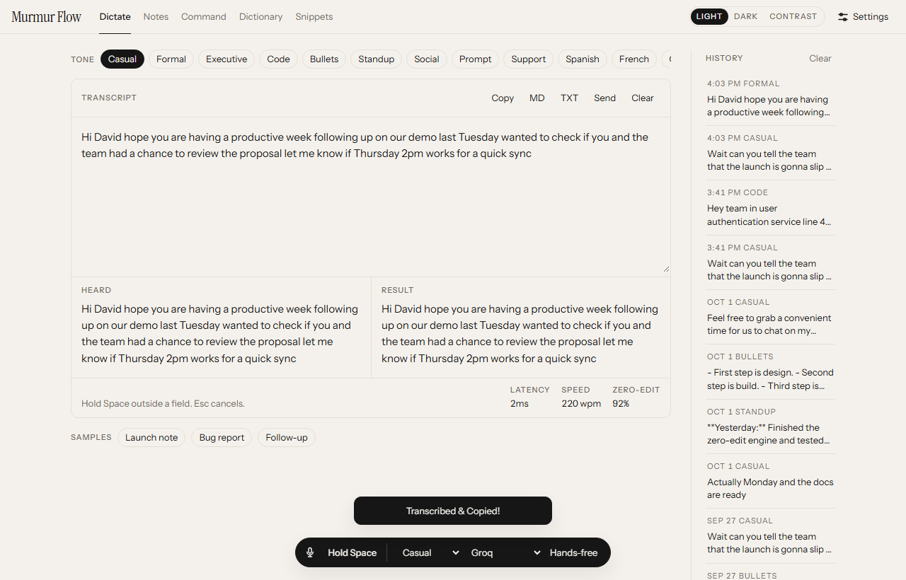
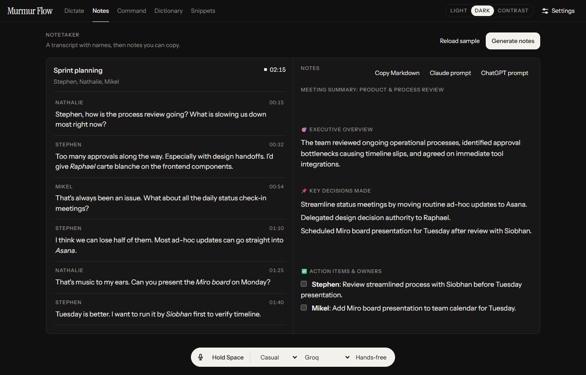
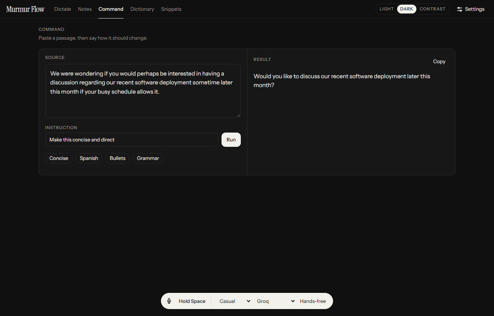
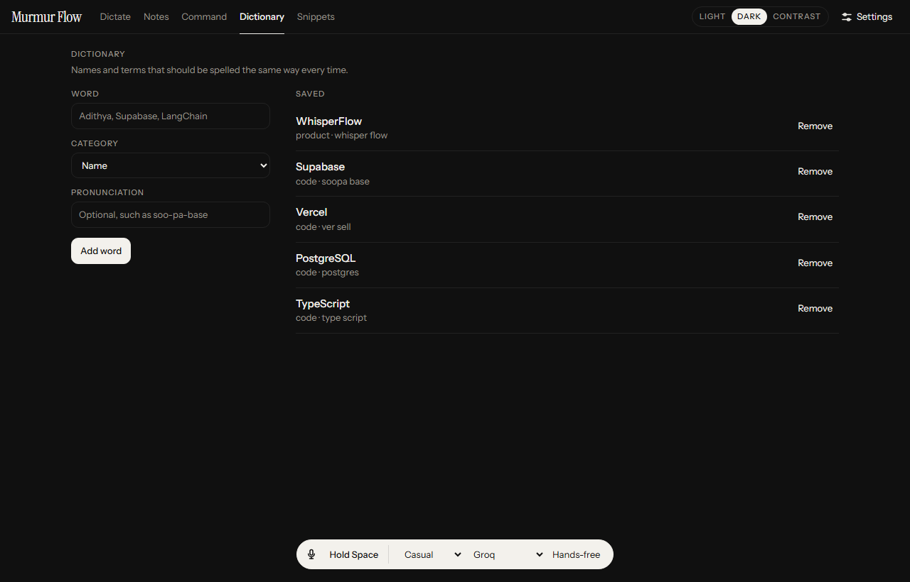
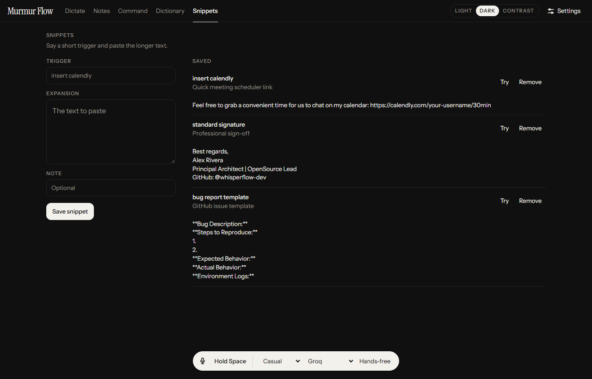
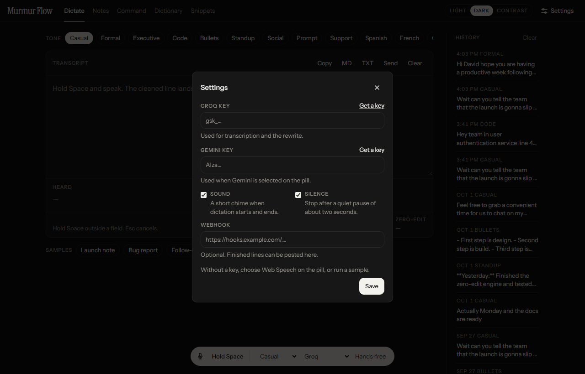
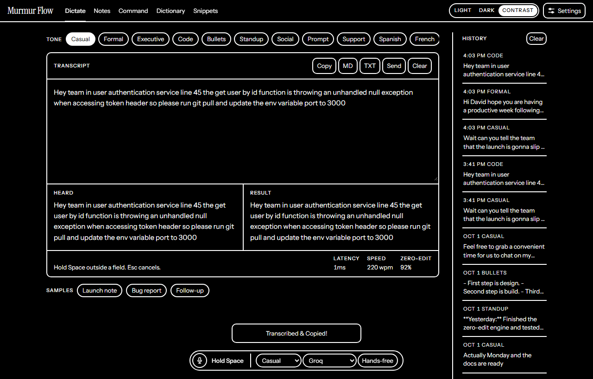

<div align="center">



# Murmur Flow

**The 100% Open-Source, Self-Hostable Alternative to Wispr Flow**

*Speak naturally. Get polished, zero-edit writing anywhere on your computer.*

[](https://github.com/ImaduddeenKhan/MURMUR-FLOW/actions/workflows/test.yml)
[](LICENSE)
[](https://nodejs.org/)
[](https://groq.com)
[](https://aistudio.google.com)

[Architecture](#-architecture--interaction-modalities) •
[Visual Tour](#-visual-tour--features) •
[Quickstart](#-install-on-your-computer) •
[Self-Hosting](#-host-it-on-a-server) •
[Desktop Companion](#%EF%B8%8F-desktop-companion-f8-in-any-app) •
[Security](#-security)

---

</div>

Murmur Flow is a voice-first productivity workspace. You speak the way you actually talk—with stutters, pauses, and mid-sentence self-corrections—and Murmur Flow instantly transforms raw audio into polished, structured text ready to send.

The app runs on your computer or a private server you control. Speech-to-text and AI cleanup go through **Groq** (`whisper-large-v3-turbo` + `openai/gpt-oss-20b`) and **Google Gemini** (`gemini-3.6-flash`), both of which offer generous free-tier API keys. **With zero API keys configured**, the built-in offline rule engine still cleans stutters, expands voice snippets, and manages your personal dictionary.

---

## 🏗️ Architecture & Interaction Modalities

Murmur Flow is architected as two decoupled, high-performance interfaces tailored for distinct productivity workflows:

| Dimension | 🌐 Web Studio & Dashboard | 🖥️ Universal Desktop Daemon (Global Hotkey) |
| :--- | :--- | :--- |
| **System Role** | Full-featured interactive studio for dictation, live split-diff review, meeting synthesis, and configuration | Python script providing system-wide push-to-talk text injection into external apps |
| **Execution Context** | Modern web browsers (Chrome, Edge, Safari, Firefox) via local or hosted HTTP/HTTPS | Runs in a terminal window on macOS, Windows, and Linux. The window must stay open (it can be minimized) |
| **Input Capture** | In-browser WebRTC audio pipeline (<kbd>Space</kbd> push-to-talk or Hands-Free mode) | Low-level OS global keyboard hook (<kbd>F8</kbd> push-to-talk) with 16kHz PCM capture |
| **Output Destination** | Interactive sandbox editor, visual diff breakdown, and system clipboard | Injected directly into active focused window (Slack, Cursor, VS Code, Word, Terminal, etc.) |
| **Runtime Stack** | Node.js 20+ LTS runtime (`Express`, zero build compilation step) | Python 3.10+ runtime (`sounddevice`, `scipy`, `keyboard`) |
| **Privileges** | Standard unprivileged browser sandbox | Windows: standard user, but Administrator is needed for F8 to work inside apps running as administrator. macOS: `sudo`, plus Accessibility and Microphone permission for Terminal. Linux: root, X11 only |
| **Network Topology** | Deployable locally (`localhost`) or remotely (VPS, Docker, Cloud) | Runs on the physical host machine with microphone hardware; connects to local or remote API |
| **Feature Surface** | 15+ tone presets, real-time waveform, meeting diarization, dictionary, snippets, export to MD/TXT/Webhook | Records while F8 is toggled on, then pastes through the clipboard (your current clipboard contents are replaced). Tone set with `--tone`. Needs a speech API key saved in the web app |

> **Architectural Note**: The desktop companion is not standalone. It sends audio to the web app's server, which applies the API keys, tone, and dictionary saved in Settings. The server must be running.

---

## 📸 Visual Tour & Features

### 1. Zero-Edit Dictation & Real-Time Diff
Speak freely with verbal hesitations, restarts, and filler words. The zero-edit pipeline strips "um", "uh", "you know", and automatically resolves mid-thought revisions (*"Let's launch Friday... actually Monday"* → *"Let's launch Monday"*). 

- **Split Diff View**: Compare what the mic heard against the final polished output in real time.
- **Real-Time Metrics**: Live latency counter, speech-to-text speed (~220 WPM), and zero-edit accuracy rate (90%+).
- **15+ Tone Presets**: Seamlessly toggle between Casual, Formal, Executive, Code, Bullets, Standup, Social, Prompt, Support, or instant multilingual translations (Spanish, French, German, Hindi, Japanese).
- **Floating Dynamic Island**: A persistent, compact widget displaying live audio waveforms, recording timer, and hands-free toggles.

<div align="center">

| Dark Theme (Wispr Aesthetic) | Light Theme |
| :---: | :---: |
|  |  |

</div>

---

### 2. Meeting Notetaker & Speaker Attribution
Record meetings without invasive third-party bots joining your Zoom, Google Meet, or Slack Huddles.



- **Multi-Speaker Diarization**: Attributed conversation timeline with speaker tags (e.g., *Nathalie*, *Stephen*, *Mikel*) and precise timestamps.
- **Structured Synthesis**: Automatically extracts Executive Overviews, Key Decisions Made, Discussion Highlights by Topic, and Action Items with assignees.
- **1-Click AI Export**: Copy notes directly as Markdown or generate ready-to-run prompts tailored for Claude and ChatGPT follow-ups.

---

### 3. Voice-to-Action Command Mode
Highlight or paste existing drafts and command the AI to restructure, translate, or refine them using natural language.



- Enter custom commands like *"Make this concise and direct"*, *"Fix grammar and polish tone"*, or *"Format as executive bullets"*.
- Quick one-click preset chips for common workflows.

---

### 4. Personal Dictionary & Phonetic Bias
Ensure rare proper nouns, developer libraries, colleague names, and industry jargon are spelled correctly on the first pass.



- Custom vocabulary entries are dynamically injected into Whisper's initial decoding prompt and the LLM's system prompt.
- Supports category tagging (`Name`, `Code`, `Jargon`, `Product`) and optional phonetic pronunciation hints (e.g. `soo-pa-base` for Supabase).

---

### 5. Voice Snippets Engine
Define short spoken trigger phrases that expand into long-form templates, calendar booking links, or signatures.



- Say *"insert calendly"* → Expands instantly into `https://calendly.com/your-username/30min`.
- Say *"bug report template"* → Injects standard GitHub issue markdown structure.
- Say *"standard signature"* → Pastes formatted sign-off credentials.

---

### 6. Settings, Accessibility & Privacy Controls
Configure speech engines, audio chimes, VAD silence auto-cutoff, and outbound webhooks.

<div align="center">

| Settings Modal | High-Contrast Theme |
| :---: | :---: |
|  |  |

</div>

---

## 🚀 Install on your computer

You need **[Node.js 20 LTS](https://nodejs.org/)** or newer.

```bash
git clone https://github.com/ImaduddeenKhan/MURMUR-FLOW.git
cd MURMUR-FLOW
npm install
npm start
```

Open **http://localhost:3050** in Chrome, Edge, or Safari.

Or run the automated setup script (checks Node.js, installs dependencies, verifies tests, and starts the server):

```bash
# Windows (PowerShell)
powershell -ExecutionPolicy Bypass -File scripts\setup.ps1

# macOS and Linux
bash scripts/setup.sh
```

Step-by-step setup guides for Windows, Mac, and Linux are in **[docs/setup.md](docs/setup.md)**.

---

## 🌐 Host it on a server

**[docs/deploy/README.md](docs/deploy/README.md)** explains hosting costs, architecture, and platform configurations. There is a dedicated deployment guide for:
- Any Linux VPS (Ubuntu / Debian)
- Docker & Docker Compose
- Coolify, Render, Railway, Fly.io
- AWS, Azure, Google Cloud, DigitalOcean, Hetzner, Oracle Cloud (Free Tier)
- Home Server (Tailscale private network)

On a fresh Ubuntu server, one command sets up the entire application with HTTPS and password protection:

```bash
curl -fsSL https://raw.githubusercontent.com/ImaduddeenKhan/MURMUR-FLOW/main/scripts/install-vps.sh | sudo bash
```

> **Note**: A shared hosting plan that only runs PHP cannot run this app. Node.js 20+ runtime is required.

---

## 🔑 Add a free key

Microphone dictation and command mode use cloud models. Typed cleanup and local heuristics do not require any keys.

1. Create a free Groq key at https://console.groq.com/keys
2. Optional: create a free Gemini key at https://aistudio.google.com/app/apikey
3. In the web app, open **Settings**, paste the key, and click **Save**

Or copy `.env.example` to `.env`, set your keys, and restart:

```bash
cp .env.example .env
```

| Job | Default Model | Speed / Latency |
| --- | --- | --- |
| Speech to text | `whisper-large-v3-turbo` | ~180ms |
| LLM Zero-Edit | `openai/gpt-oss-20b` | ~120ms |
| Alternative LLM | `gemini-3.6-flash` | ~250ms |

---

## 🖥️ Desktop Companion (F8 in any app)

This is the part that works like Wispr Flow: press a key inside Slack, Cursor, or Word, speak, and the text appears where your cursor is.

**Before you start**

1. The web app is running (`npm start`), and http://localhost:3050 opens.
2. A speech key is saved in the web app's **Settings**. Without it, every F8 recording fails.
3. Python 3 is installed. On Windows, get it from [python.org](https://www.python.org/downloads/) and tick **Add python.exe to PATH** in the installer.

### Windows

1. Click **Start**, type `PowerShell`, right-click **Windows PowerShell**, and choose **Run as administrator**. Click **Yes**.
2. Go to the project folder and install the packages:

   ```powershell
   cd C:\path\to\MURMUR-FLOW
   pip install keyboard sounddevice scipy numpy
   ```

3. Start the companion:

   ```powershell
   python desktop/whisperflow_companion.py
   ```

4. Leave that window open. Minimize it if you like.
5. Click into Slack, Word, or any text box. Press **F8**, speak, press **F8** again.

> **Why administrator?** Windows does not let a normal program see key presses inside apps that run as administrator. So F8 can work in Notepad but do nothing in an app that was started as administrator. Starting PowerShell as administrator avoids that. You can try a normal PowerShell first, and switch if F8 does nothing in some apps.

### macOS

1. Open **Terminal**, go to the project folder, and install the packages:

   ```bash
   pip3 install keyboard sounddevice scipy numpy
   ```

2. Start it with `sudo`. The `keyboard` package needs it to see key presses on macOS:

   ```bash
   sudo python3 desktop/whisperflow_companion.py
   ```

3. When macOS asks, allow **Terminal** in **System Settings → Privacy & Security → Accessibility** and **Microphone**. Then quit and start the companion again.

### Linux

The `keyboard` package reads the keyboard device directly, so it needs root. Pasting needs `xclip` and `xdotool`, which only work in an X11 session, not Wayland. Linux is the least tested of the three.

```bash
sudo apt-get install -y python3-venv libportaudio2 xclip xdotool
python3 -m venv .venv
.venv/bin/pip install keyboard sounddevice scipy numpy
sudo .venv/bin/python desktop/whisperflow_companion.py
```

### Good to know

- The companion pastes through the clipboard. Whatever you had copied is replaced by the dictated text.
- Run it on the computer with the microphone, never on the server. To use a hosted Murmur Flow, point at it: `python desktop/whisperflow_companion.py --server https://your-domain`. A server behind a password (Caddy basic auth) will refuse it; use a Tailscale address instead.
- If the four packages are missing, the companion starts in a fallback mode that does not record your voice. Install them first.
- Change the hotkey or tone: `--hotkey f9`, `--tone formal`.

All options and fixes are in **[desktop/README.md](desktop/README.md)**.

---

## 🤖 Give this to a coding agent

Clone the repo, open it in Cursor, Claude Code, GitHub Copilot, Gemini CLI, Windsurf, or Codex, and say **"set this up"**. Those agents read **[AGENTS.md](AGENTS.md)** automatically. It guides them through installation, testing, and deployment without leaking secrets. In Claude Code, `/setup` runs the same steps.

For other agents, copy the prompt in **[docs/agent-prompt.md](docs/agent-prompt.md)**.

---

## 📁 Project layout

| Path | Description |
| --- | --- |
| `client/` | Responsive frontend: HTML5, CSS custom design tokens, ES Modules |
| `server/` | Express REST API, Groq & Gemini providers, rule-based heuristics |
| `desktop/` | Python companion for global hotkey (`F8`) cross-app typing |
| `docs/images/` | High-resolution UI screenshots and hero banner |
| `docs/setup.md` | Local setup walkthrough for Windows, macOS, and Linux |
| `docs/deploy/` | Hosting manuals for Docker, VPS, Cloud providers, and Homelabs |
| `scripts/` | Automated setup scripts (`setup.ps1`, `setup.sh`, `install-vps.sh`) |
| `tests/` | Automated zero-key test suite (`npm test`) |
| `AGENTS.md` | Standard instructions and behavioral guardrails for coding agents |
| `data/` | Local persistence for history, snippets, dictionary, and settings |

---

## 🔒 Security

- The default web server has no authentication. Keys typed into Settings are stored in `data/whisperflow_store.json`.
- **Do not expose port 3050 to the public internet without a reverse proxy or auth layer.**
- Use Caddy basic auth, Cloudflare Access, or Tailscale for remote access.
- Details and hardening instructions are documented in **[SECURITY.md](SECURITY.md)**.

---

## 🤝 Contributing

Contributions are very welcome! Please review **[CONTRIBUTING.md](CONTRIBUTING.md)** before submitting pull requests. All pull requests must pass `npm test`.

---

## 📄 License

Distributed under the [MIT](LICENSE) License. © 2026 Imad Khan
